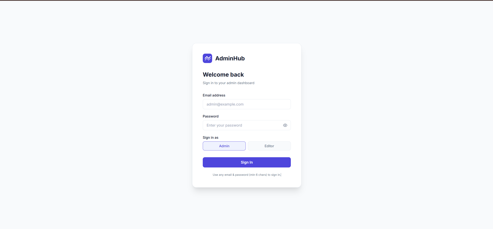
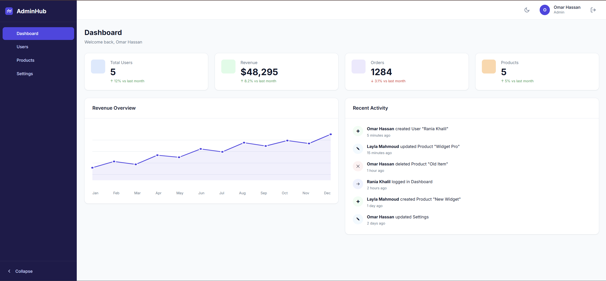
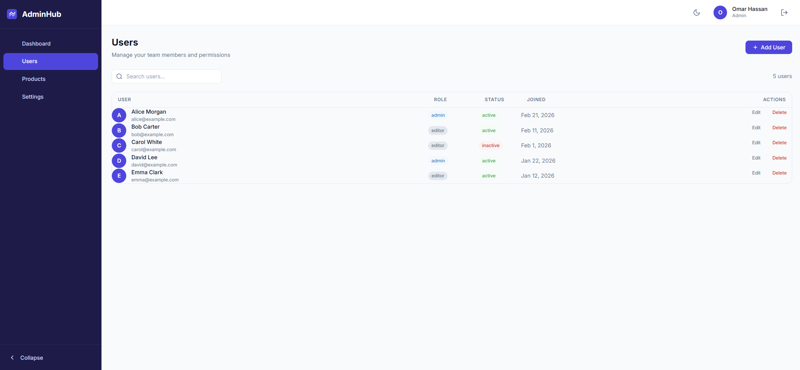
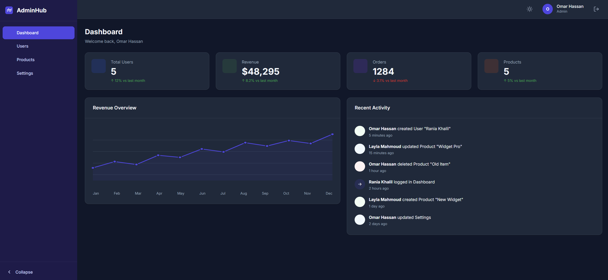

# AdminHub — Production-Grade SaaS Admin Dashboard

A fully featured, production-ready Angular 20+ SaaS Admin Dashboard built with enterprise-level architecture, best-in-class performance patterns, and a clean minimal design system — no UI frameworks, no Tailwind, no Bootstrap.

---

## Screenshots

| Login | Dashboard |
|:-----:|:---------:|
|  |  |
| **Users** | **Dark Mode** |
|  |  |

---

## How to Run

```bash
# Clone / navigate to the project
cd admin-dashboard

# Install dependencies
npm install

# Start development server
ng serve

# Open in browser
http://localhost:4200
```

### Login credentials
Use **any email** and **any password** (minimum 6 characters). Choose a role:
- **Admin** — full access (create, edit, delete users and products)
- **Editor** — restricted access (cannot delete users)

### Production build
```bash
ng build                   # production build
ng build --watch           # watch mode
```

---

## Project Structure

```
src/
├── app/
│   ├── core/
│   │   ├── guards/
│   │   │   ├── auth.guard.ts          # Protects authenticated routes
│   │   │   └── guest.guard.ts         # Redirects authenticated users away from login
│   │   ├── interceptors/
│   │   │   └── error.interceptor.ts   # Centralized HTTP error handling
│   │   └── services/
│   │       ├── auth.service.ts        # Signal-based auth state
│   │       ├── loading.service.ts     # Global loading counter
│   │       ├── mock-api.service.ts    # RxJS fake backend with delay
│   │       ├── notification.service.ts # Toast notification system
│   │       ├── storage.service.ts     # localStorage abstraction
│   │       └── theme.service.ts       # Light/dark theme management
│   │
│   ├── features/
│   │   ├── auth/                      # Lazy-loaded login feature
│   │   ├── dashboard/                 # Stats, SVG chart, activity feed
│   │   ├── users/                     # Full CRUD with search and modal
│   │   ├── products/                  # CRUD with pagination and filters
│   │   └── settings/                  # App preferences with reactive form
│   │
│   ├── layout/
│   │   ├── navbar/                    # Top bar with user info and theme toggle
│   │   ├── sidebar/                   # Collapsible navigation
│   │   └── shell/                     # App shell that wraps all protected routes
│   │
│   ├── models/                        # TypeScript interfaces and types
│   ├── shared/
│   │   └── components/
│   │       ├── button/                # Variant: primary | secondary | danger | ghost | outline
│   │       ├── card/                  # Container with optional title
│   │       ├── input/                 # CVA-based input with validation
│   │       ├── modal/                 # Keyboard-accessible modal (Escape closes)
│   │       ├── spinner/               # Loading indicator
│   │       ├── table/                 # Reusable table with loading state
│   │       └── toast/                 # Toast notifications anchored to bottom-right
│   └── utils/                         # Pure helper functions (date, id)
│
└── styles/
    ├── _variables.scss                # CSS custom properties (colors, spacing, typography)
    ├── _mixins.scss                   # Reusable SCSS mixins
    ├── _layout.scss                   # Page layout utilities
    └── _components.scss               # Shared component styles (badge, form, table)
```

---

## Architecture Decisions

### Why Angular Signals?

Angular Signals (stable since Angular 17) provide **fine-grained reactivity** without zone.js overhead. Using `signal()`, `computed()`, and `effect()`:

- **No zone pollution** — state changes trigger only the specific component/computed that depends on them
- **Synchronous reads** — `signal()` values are read synchronously like plain values, making templates and logic cleaner
- **Type-safe derived state** — `computed()` automatically re-evaluates when its signal dependencies change
- **Predictable updates** — `signal.update(fn)` enforces immutable update patterns

Example in `AuthService`:
```typescript
private readonly _user = signal<AuthUser | null>(null);
readonly isAuthenticated = computed(() => this._user() !== null);
readonly isAdmin = computed(() => this._user()?.role === 'admin');
```

### Why `ChangeDetectionStrategy.OnPush`?

`OnPush` tells Angular to skip change detection for a component unless:
1. An `@Input` reference changes
2. A Signal dependency updates
3. An event originated from within the component

This dramatically reduces the number of change-detection cycles in the component tree, especially important in a data-heavy dashboard with many list items and table rows. Every component in this project uses `OnPush`.

### Memory Leak Prevention Strategy

All RxJS subscriptions are protected against memory leaks using `takeUntilDestroyed(destroyRef)` from `@angular/core/rxjs-interop`:

```typescript
// ✅ Correct — destroyRef is captured once per component instance
private readonly destroyRef = inject(DestroyRef);

this.api.getUsers()
  .pipe(takeUntilDestroyed(this.destroyRef))
  .subscribe(res => { ... });
```

`takeUntilDestroyed` automatically completes the observable when the component is destroyed, without requiring a manual `Subject` or `ngOnDestroy` boilerplate. The `DestroyRef` is injected and passed explicitly (rather than calling `takeUntilDestroyed()` without arguments) to ensure it works correctly whether called inside or outside the constructor.

### Why RxJS + Signals Together?

| Concern | Tool |
|---------|------|
| Component-local UI state | `signal()` |
| Derived/computed state | `computed()` |
| Async API calls | `Observable` + RxJS operators |
| Real-time streams / debounce / filter | `Subject` + `debounceTime` + `distinctUntilChanged` |
| Search input with 300ms debounce | `FormControl.valueChanges` → `Subject` → RxJS pipeline |

RxJS excels at **composing async operations** (debounce, filter, combine), while Signals excel at **synchronous reactive state**. They complement each other perfectly.

### Clean Architecture Principles Applied

- **Single Responsibility** — each service handles exactly one concern
- **Dependency Inversion** — components depend on service abstractions, not concrete implementations
- **Feature modules** — each feature is independently lazy-loaded
- **Immutable updates** — signals and state are always updated with new object references, never mutated

---

## Technology Choices

| Technology | Version | Reason |
|-----------|---------|--------|
| Angular | 20+ | Signals, standalone components, `@for` control flow |
| TypeScript | 5.5 | Strict typing, type inference |
| RxJS | 7+ | Async streams, search debounce |
| Angular Signals | built-in | Reactive state without NgRx overhead |
| SCSS | — | CSS custom properties + BEM-lite structure |

**No** NgRx, **No** Tailwind, **No** Bootstrap, **No** third-party component libraries.

---

## Features Implemented

### Authentication
- [x] Reactive login form with validation
- [x] Role selector (admin / editor)
- [x] `AuthGuard` protecting all dashboard routes
- [x] `GuestGuard` preventing login page access when authenticated
- [x] Session persisted in `localStorage`
- [x] Logout functionality

### Layout
- [x] Collapsible sidebar with active route highlighting
- [x] Responsive — sidebar hides on mobile with overlay
- [x] Top navbar with user info, theme toggle, logout
- [x] Sidebar collapse state persisted in `localStorage`

### Dashboard
- [x] 4 stat cards with trend indicators
- [x] SVG area chart (revenue over 12 months)
- [x] Recent activity feed with `timeAgo` formatting
- [x] All data loaded via `forkJoin` in parallel

### Users
- [x] Paginated table with avatar, role, status, joined date
- [x] RxJS-powered search with 300ms debounce
- [x] Add User modal with reactive form + validation
- [x] Edit User with pre-populated form
- [x] Delete User (admin only — role-based restriction)
- [x] Seeded with 5 mock users on first load

### Products
- [x] Paginated table (5 per page) with pagination controls
- [x] Search with debounce + category filter
- [x] Add/Edit product modal with full validation
- [x] Low stock indicator (< 10 highlighted in orange)
- [x] Seeded with 5 mock products on first load
- [x] Data persisted in `localStorage` via `MockApiService`

### Settings
- [x] Profile display (name, email, role)
- [x] Dark/Light mode toggle (synced with `ThemeService`)
- [x] Language and date format selectors
- [x] Email and push notification toggles
- [x] Preferences persisted in `localStorage`
- [x] Reset to defaults button

### Design System
- [x] CSS custom properties for all tokens (colors, spacing, typography, shadows)
- [x] Full dark theme via `[data-theme='dark']` attribute
- [x] Responsive breakpoints (desktop → tablet → mobile)
- [x] Button component (primary, secondary, danger, ghost, outline variants)
- [x] Toast notifications (success, error, warning, info)
- [x] Modal with keyboard (Escape) support and scroll lock
- [x] Loading spinner with size variants

---

## Pushing to a Repository

The project is ready to push. A proper `.gitignore` is included (excludes `node_modules`, `dist`, etc.).

```bash
# Initialize git (if not already)
git init

# Add all files
git add .

# Initial commit
git commit -m "Initial commit: AdminHub SaaS dashboard"

# Add remote and push (replace with your repo URL)
git remote add origin https://github.com/your-username/admin-dashboard.git
git branch -M main
git push -u origin main
```

---

## Deployment

### Vercel / Netlify
```bash
ng build
# Deploy the dist/admin-dashboard/browser/ folder
# Set rewrite rule: /* → /index.html
```

### Docker
```dockerfile
FROM node:20-alpine AS build
WORKDIR /app
COPY . .
RUN npm ci && npm run build

FROM nginx:alpine
COPY --from=build /app/dist/admin-dashboard/browser /usr/share/nginx/html
COPY nginx.conf /etc/nginx/conf.d/default.conf
EXPOSE 80
```

`nginx.conf`:
```nginx
server {
  listen 80;
  root /usr/share/nginx/html;
  index index.html;
  location / {
    try_files $uri $uri/ /index.html;
  }
}
```

---

## Performance Checklist

- [x] `ChangeDetectionStrategy.OnPush` on every component
- [x] Lazy-loaded feature routes (each feature is a separate JS chunk)
- [x] `trackBy` via `@for ... track` syntax on all list iterations
- [x] `takeUntilDestroyed` prevents all memory leaks
- [x] `debounceTime(300)` + `distinctUntilChanged()` on search inputs
- [x] `computed()` signals for derived state (chart points, paths)
- [x] `forkJoin` to batch parallel API calls on dashboard
- [x] No unnecessary subscriptions — observables complete or are torn down

---

*Built as a portfolio demonstration of production-grade Angular architecture.*
